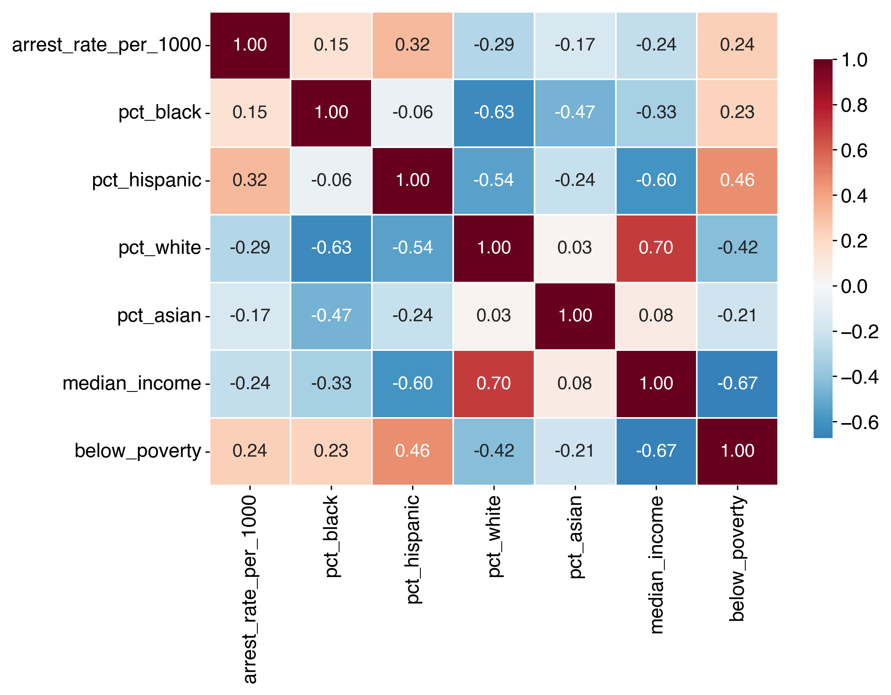
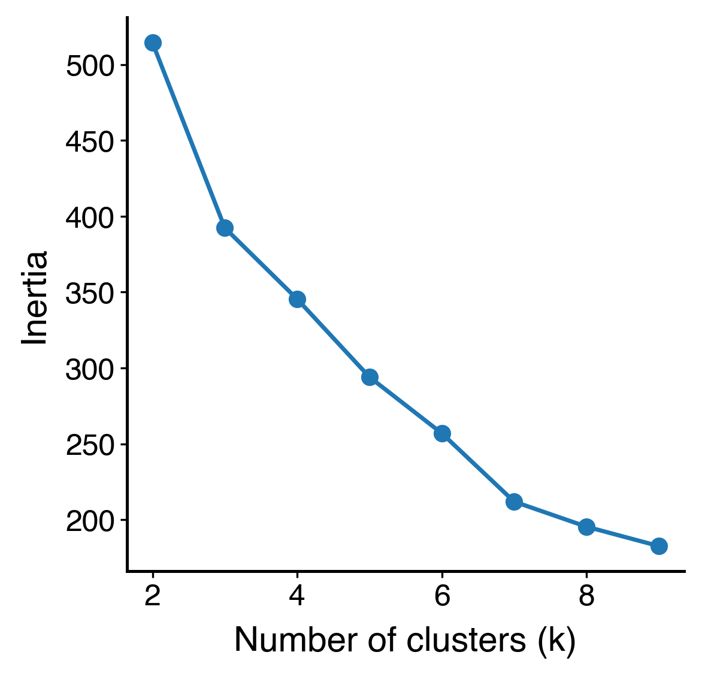
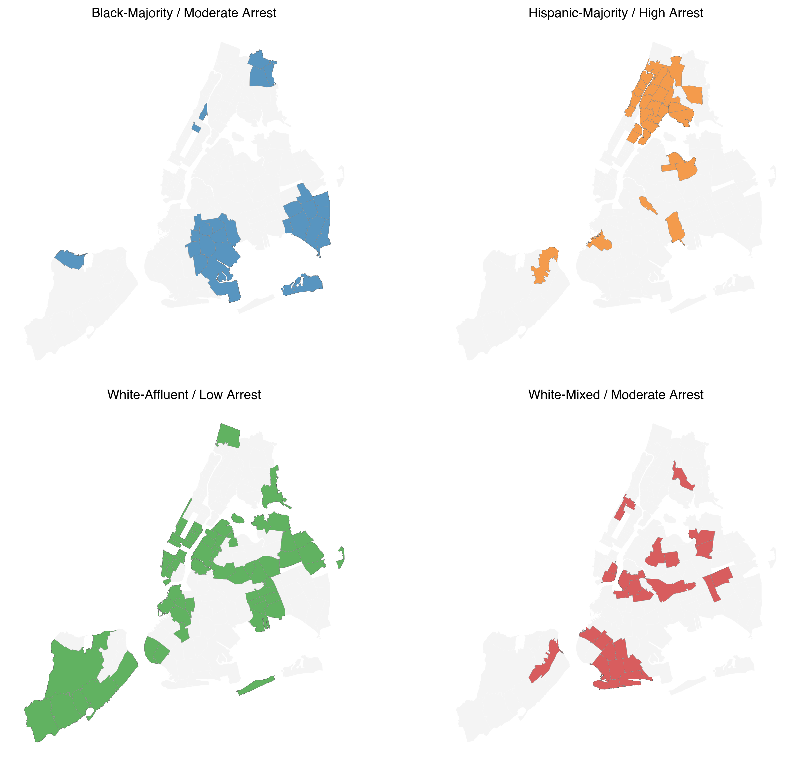

# Introduction

In New York City, policing generates an extensive administrative record of complaints and arrests that increasingly feeds into statistical models and algorithmic tools. These data are often treated as neutral indicators of crime and public safety, suitable for use in predictive-policing systems, performance dashboards, and resource-allocation decisions. Yet if arrest patterns themselves are shaped by racialized enforcement, then relying on arrests as “objective” measures risks reproducing and amplifying existing biases rather than simply reflecting underlying harm.
This paper asks:  How do racial composition, income, and poverty predictors affect arrest intensity in NYC, controlling for population size and offense type? We pursue two sub-questions. First, do socioeconomic differences in income and poverty explain racial disparities in arrest rates, or do racial effects persist even after conditioning on these factors? Second, how do the spatial distributions of arrest intensity and complaint intensity align or diverge, and what do these similarities or discrepancies reveal about potential over-policing?
These questions arise as national debates about police bias frequently focus on singular incidents, while broader spatial patterns of enforcement receive less attention. If the intensity of arrest is disproportionately high in specific racialized areas, then arrest counts cannot be treated as dispassionate indicators of crime. Instead, using them directly in algorithmic systems risks hard-coding structural bias into tools that guide future policing and policy.
To address these issues, we conduct a systematic study of arrest intensity in New York City in 2023. Our approach combines cross-sectional regression models, exploratory correlation analysis, and choropleth mapping with a normative discussion of how arrest data are used in algorithmic systems. We show that racial composition—particularly the percentages of Black and Hispanic residents—remains significantly associated with arrest intensity even after adjusting for income, poverty, and population size. 

## Racial disparities in policing

Research on racial disparities in policing provides critical context for this study. In a foundational analysis of New York City’s stop-and-frisk program, Gelman, Fagan, and Kiss (2007) examined roughly 175,000 pedestrian stops and found that Black and Hispanic individuals were stopped at significantly higher rates than white individuals, even after controlling for precinct-level variation and local crime rates. Their results directly challenged the claim that racial disparities simply mirror differential crime rates. This suggests that enforcement intensity is shaped not only by underlying criminal activity but also by decisions about where, whom, and how aggressively to police.
These findings frame racial disparity as a structural feature of policing practice rather than an incidental byproduct of individual bias. They also highlight the importance of looking beyond individual encounters to area-level patterns—an approach this paper adopts by analyzing arrest intensity across ZIP codes in New York City.

## Algorithmic Bias and Feedback Loops
A second strand of literature examines what happens when historically biased enforcement data are incorporated into algorithmic systems. Lum and Isaac (2016) model the deployment of PredPol – predictive policing software–  in Oakland using historical drug arrest data. They show that the algorithm would disproportionately direct police to Black and Hispanic neighborhoods, not because those areas had higher rates of drug use, but because they had been policed more heavily in the past. This dynamic creates a feedback loop: intensive policing generates more arrests; the predictive system interprets these arrests as evidence of heightened risk; and the model then recommends even more enforcement in the same areas. The algorithm, in effect, predicts where police are most likely to look for crime, not where crime inherently is.
This feedback-loop logic directly connects to the questions in this paper. If arrest intensity is already racially patterned across space, and those arrest counts are then used as inputs into predictive systems or performance metrics, algorithmic tools may encode and perpetuate those patterns under the guise of neutral optimization. By examining neighborhood-level arrest intensity, demographic structure, and complaint intensity in contemporary New York City, this study extends the insights of Lum and Isaac (2016) to a broader set of enforcement outcomes and evaluates the risks of treating arrest data as objective indicators in data-driven policing.

# Data Sources and Methodology

## Sources 

This project integrates two main data sources into a single, ZCTA-level dataset of police and neighborhood characteristics in New York City: the source data are the 2023 NYPD Arrest Dataset, which comprise discrete arrest events and include ZIP code of arrest, offense type (felony, misdemeanor, and violation), along with event-level attributes; analysis aggregates events to the ZIP-code level to calculate total arrests and arrest intensity.
The second source is the 2019–2023 American Community Survey (ACS) 5-Year Estimates, which provide demographic and socioeconomic variables at the ZCTA level. Key demographic measures include the percentage of Black, Hispanic, White, and Asian residents; socioeconomic measures include median household income, poverty rate, and total population size. These variables are used both as controls and predictors in the statistical models and allow per-capita normalization of arrest counts.
The final dataset is the NYC ZIP Code / ZCTA Shapefile, which helps in the visualization of spatial patterns using choropleth maps. This shapefile contributes geographic boundaries so that each ZIP code used in the analysis has a spatial representative within the geospatial section.

## Temporal Focus

The decision to study 2023 arrest data was motivated by both methodological and substantive considerations. First, the ACS 2019–2023 estimates align temporally with the arrest data, avoiding mismatches that would arise if older policing data were paired with newer demographic information. Second, 2023 is the most recent year with complete, standardized NYPD reporting. This offers consistent coverage and reliable column formatting. 2023 also reflects conditions in the post-COVID period, making the findings directly relevant to contemporary public policy discussions. Using the latest available year ensures that the patterns identified are both current and reflective of present enforcement practices.

## Cleaning and Construction

Several data-cleaning steps in building the analytic dataset were used  in order for the data to be accurate and comparable across different ZIP codes. First, the arrest and ACS datasets were merged by ZCTA/ZIP code. All rows having either missing or zero population values were removed from the data to prevent undefined or inflated per-capita arrest rates. Coerced into numeric format were the following important columns that included arrest counts, racial population counts, and income and poverty variables. Next, extreme or invalid values were dealt with. Specifically, ZIP codes with values of arrest rates greater than three standard deviations above the mean were eliminated to reduce distortion from statistical outliers. Additional filtering excluded ZIP codes with very small populations (less than 20,000 residents), thus reducing volatility in per-capita measures. There were 151 ZIP codes remaining in the final analytic data set after these cleaning steps. The dataset was validated against the ZCTA shapefile for complete geographic coverage in subsequent spatial analysis. This step makes sure that every ZIP code included in the regressions also appears in the choropleth maps. This eliminated inconsistencies between the statistical and spatial components of the study.
Taken together, these cleaning and construction steps help ensure that any patterns identified in the descriptive statistics, geospatial visualizations or regression models reflect real neighborhood-level differences, rather than artifacts of missing data, measurement inconsistencies or mismatched geographic units.

# Exploratory Data Analysis

Our analysis begins by merging NYPD's 2023 arrest data with American Community Survey's 5-year demographic estimates at the ZIP Code Tabulation Area (ZCTA) level. This exploratory phase provides a descriptive grounding for the modeling and fairness analysis in the consequent sections. 

## Citywide Arrest Patterns 

Across the 151 in-scope ZIP codes, NYPD recorded 189,260 arrests in 2023 for a total population of 8.18 million. Among this population, the citywide average arrest rate was approximately 23.14 arrests per 1,000 residents. 

Breaking this down by racial categories, there are significant disparities. Black residents experienced approximately 87,590 arrests across a reported population of 1.72M and Hispanic residents experienced 69,365 arrests across a reported population of 2.36M. In contrast, out of a population of 2.52M, White residents experienced a drastically lower 18,601 arrests in 2023. Even prior to statistical modeling, these aggregrates may suggest that Black and Hispanic populations experience substantially higher policing exposure than their population shares relative to racial categories that have not been historically marginalized. 

## High-Arrest and Low-Arrest Neighborhoods 

A closer examination Zip Code-level arrest intensities revealed substantial heterogeneity across New York City. Even after normalizing by population, various extremes highlight how unevenly policing exposure is distributed across the city's neighborhoods. 

::: center
| ZCTA | Arrests per 1,000 | % Black | % Hispanic | % White | % Asian | Median Income |
|------|-------------------|---------|------------|---------|---------|----------------|
| **10013** | 90.59 | 3% | 8% | 53% | 31% | $159,474 |
| **10035** | 81.19 | 35% | 42% | 14% | 6% | $40,556 |
| **10451** | 75.20 | 40% | 51% | 6% | 1% | $37,111 |
| **10301** | 70.96 | 23% | 29% | 37% | 7% | $84,937 |
| **10454** | 70.08 | 23% | 70% | 3% | 0% | $27,500 |
: Highest-Arrest ZIP Codes in New York City (Top 5)
{#tbl-high-arrest}
:::

The five ZIP codes with the highest rest intensities, along with the percentage of the demographic composition of that region. Most of these zipcodes fall in historically disadvantaged areas: the South Bronx (10451, 10454), East Harlem (10035), and parts of Staten Island’s North Shore (10301). 3 out of the 5 zip codes shown above demonstrate high proportions of Black and Hispanic residents. This correlated relationship (though not causal) may suggest uneven policing in these areas. 

A main anomaly is ZIP 10013 (Tribeca/SoHo), which combines a small residential base with heavy commercial, nightlife, commuter, and tourist activity. Its arrest intensity likely reflects enforcement directed at public activity in high-traffic areas rather than policing of resident populations.

::: center
| ZCTA | Arrests per 1,000 | % Black | % Hispanic | % White | % Asian | Median Income |
|------|-------------------|---------|------------|---------|---------|----------------|
| **11040** | 0.61 | 0.01 | 0.11 | 0.39 | 0.44 | $153,511 |
| **11001** | 1.17 | 0.06 | 0.15 | 0.51 | 0.24 | $144,755 |
| **10128** | 2.95 | 0.05 | 0.13 | 0.67 | 0.10 | $148,705 |
| **10075** | 3.02 | 0.01 | 0.05 | 0.79 | 0.10 | $146,556 |
| **11364** | 3.13 | 0.02 | 0.15 | 0.29 | 0.50 | $101,222 |
: Lowest-Arrest ZIP Codes in New York City (Top 5)
{#tbl-low-arrest}
:::

On the converse, the lowest-arrest ZIP codes in New York City form a clear and distinct group: they are among the wealthiest, least-policed neighborhoods in the city. Median household incomes in these areas range from roughly $100k to $158k and represent a highly skewed racial composition. These ZIP cocdes are predominantly White and Asian with very small Black and Hispanic populations (often below 5%). Arrest intensities in these neighborhoods are extraordinarily low ranging from 0.6 to 3.6 arrests per 1,000 residents; a metric that is substantially lower than the citywide mean of roughly 23 arrests per 1,000. 

Furthermore, these ZIP codes also share similar built-in environment characteristics by being considered as suburban-like. These areas have had stable residential patterns and historically receive lower levels of proative policing, reflecting actual differences in crime reporting environments and engraved geographical inequities. 

The dichotomy of the low-arrest and high-arrest geographical zones sets the stage for further analyses that suggest that arrest intensity is not simply randomly distributed across space, but rather, clings on predictable demographic and socioeconomic divides. 

## Demographic Correlates of Arrest Intensity

The correlation analysis conducted provides a compact summary of how arrest intensity relates to the demographic and socioeconomic composition of New York City zip codes (See @fig-corr). 

{#fig-corr width="75%"}

Firstly, arrest intensity correlates strongly with Hispanic population share and poverty. Arrest rate per 1,000 residents shows a positive correlation with the percent of Hispanic residents (+0.32) and poverty (+0.24), indicating that ZIP codes with larger Hispanic populations may tend to experience higher arrest rates. 

Secondly and equally as notable, higher-income areas exhibit substantially lower arrest intensity. Median income is negatively correlated with arrest rate (-0.24), confirming geographic inequalitys where neighborhoods with higher incomes and lower socioeconomic precarity see significantly less policing exposure. 

However, this analysis only captures slices of the underlying structure. Due to the multidimensional and highly entangled structure of these relationships, these preliminary findings motivate the use of statistical methods that reinforce initial assumptions. 

# Regression Modeling and Key Quantitative Results

To examine how the characteristics of a neighborhood predict arrest intensity in New York City, a set of OLS models were first estimated using arrests per 1,000 residents as the dependent variable. The analyses were all conducted at the ZIP Code Tabulation Area level, using the cleaned dataset including 151 ZIP codes.

## Model 1: Race-only OLS

The first model examines whether racial composition by itself helps explain differences in arrest intensity across New York City. This model predicts arrests per 1,000 residents using just two predictors: the percent of Black residents and the percent of Hispanic residents in each ZIP code. Both predictors are positive and statistically significant. In practical terms, a 10-percentage-point increase in the Black share of a ZIP code is associated with about 1.3 more arrests per 1,000 residents, and a similar increase in the Hispanic share is associated with about 3 more arrests per 1,000 residents, holding all else constant.
Racial composition alone explains about 13 percent of the variation in arrest intensity across ZIP codes. While 13 percent is a modest number, it is large for a model with only two variables, and suggests a clear pattern: arrest intensity increases systematically with increasing Black and Hispanic population share. This is enough to establish racial composition as a meaningful predictor of policing intensity even before socioeconomic factors are taken into account.

## Model 2: Income and Poverty Predictors Extension

The second model adds median household income and poverty rate to test whether socioeconomic conditions explain the racial differences observed in Model 1. If policing intensity were driven mainly by economic disadvantage, the effects of percent Black and percent Hispanic would shrink once income and poverty were included. Instead, the racial coefficients remain almost unchanged and continue to be statistically significant, while model fit improves only minimally (R² increases from 0.135 to 0.141). Median income and poverty rate themselves are not significant predictors in this model, which indicates that these measures are closely tied to the racial makeup of neighborhoods and do not independently account for differences in arrest intensity.
This model suggests that the racial disparity in arrest intensity remains even after adjusting for income and poverty. The racial composition predicts where policing is most intense in ways not explained by socioeconomic variables.

## Model 3: Population Predictor Extension

The third model adds the log of total population to account for the fact that ZIP codes vary substantially in size: smaller ZIP codes can produce unstable per-capita arrest rates simply because a few arrests can generate a high rate. Controlling for population helps determine if the earlier results were driven by noise, rather than actual variation between neighborhoods. Including population improves the fit of the model somewhat (R² increases to 0.176), but does not change the overall pattern. Percent Hispanic remains a strong and statistically-significant predictor of arrest intensity, while percent Black becomes marginally significant. Median income becomes significant and negative in this specification: once controlling for race and population, low-income ZIP codes tend to have higher arrest intensity. The population term is positive and significant, though its effect is modest.
Taken together, these findings demonstrate that the racial pattern identified in prior models was not driven by variation in ZIP-code size. Once again controlling for population structure, larger Black and Hispanic populations are associated with greater arrest intensity in every specification.

# Unsupervised Machine Learning: K-means Clustering

While the regression models quantify how individual variables (race, income, poverty, population) relate to arrest intensity, they do not directly describe the joint neighborhood patterns that emerge when these factors are reconciled. To capture these neighborhood patterns, we apply unsupervised machine learning, specifically k-mean clustering, to group ZIP codes into interpretable "neighborhood types". 

## Methodology 

We construct a feature matrix using the following standardized variables: arrest intensity (arrests per 1,000 residents), racial composition, and socioeconomic status such as median household income and poverty count / rate. 

{#fig-elbow width="50%"}

To ensure reproducible results and to prevent unusual inflation, each feature was standardized. We then fit k-means for \(k \in \(2, \dots, 9\)\) and inspect the resulting elbow plot (See @fig-elbow). The curve shows a steep improvement in within-cluster fit between \(k=2\) and \(k=4\) with diminishing returns afterwards. On this basis, four clusters were chosen as the primary level of specificity. 

## Neighborhood Profiles

The cluster analysis groups NYC ZIP codes into four distinct neighborhood profiles, each defined by a characteristic combinations of racial composition, income levels, and arrest intensity. Table @tbl-cluster-summary summarizes the cluster-level averages with a discussion of the significance of three notable groups to follow. 

::: center
| Cluster Label                          | Arrests per 1,000 | % Black | % Hispanic | Median Income | Poverty Count |
|----------------------------------------|-------------------:|--------:|-----------:|--------------:|--------------:|
| **Black-Majority / Moderate Arrest**   | 21.64             | 0.59    | 0.17       | $76,513       | 9,450         |
| **Hispanic-Majority / High Arrest**    | 37.83             | 0.21    | 0.58       | $55,109       | 15,930        |
| **White-Affluent / Low Arrest**        | 17.91             | 0.06    | 0.19       | $116,869      | 4,005         |
| **White-Mixed / Moderate Arrest**           | 21.88             | 0.11    | 0.24       | $70,831       | 14,916        |

: Cluster-Level Average Summary Statistics for NYC ZIP Codes
{#tbl-cluster-summary}
:::

### Black Majority / Moderate-Arrest Neighborhoods 

This cluster is composed of ZIP codes with some the highest proportions of Black residents in the city (59%). Despite median incomes that fall near the city wide midpoint, arrest intensity here remains substantially above low-arrest clusters, averaging 21.6 arrests per 1,000 residents. These neighborhoods are primarily located in Southeast Queens, Northern Manhattan, and sections of Brooklyn (See @fig-cluster-maps). These areas have been historically shaped by residential segregration, disproportionate, and deep disinvestment.

### Hispanic Majority / High-Arrest Neighborhoods

The second cluster displays the clearest structure: Hispanic-majority ZIP codes with the highest arrest intensity in the entire dataset, averaging 37.8 arrests per 1,000 residents (See @fig-cluster-maps). 

{#fig-cluster-maps width="67%"}

Among the ZIP codes are neighborhoods concentrated in Upper Manhattan such as Harlem and Washington Heights and the South and Central Bronx. These communities also report the highest poverty levels among the four clusters and the lowest median incomes (<$55,000). This profile represents the most pronounced intersection of racial composition, socioeconomic advantage, and policing intensity. The magnitude of enforcement is nearly double of that in several Black-majority neighborhoods and more than two times that of affluent White areas. 

In structural terms, these ZIP codes form the core of the city's arrest hotspot geograph, further supported by the additional geospatial analysis to follow. 

Together, these clusters demonstrate that NYC arrest intensity does not vary randomly across space. Instead, it sorts into distinct racialized geographies, with highest-levels of enforcement overwhelmingly concentrated in Hispanic-majority neighborhoods, followed by Black-majority neighborhoods, and the lowest rates found in affluent White areas. These results prove consistent with our initial assumptions and previous linear regression modeling analyses. 

### White-Affluent / Low-Arrest Neighborhoods 

This cluster inclues some of NYC's wealthiest ZIP codes with average median household incomes exceeding $116,000 (See @tbl-cluster-summary, @fig-cluster-maps) and a racial composition that is predominantly White and Asian. These neighborhoods have some of the lowest arrest rates anywhere in the city, averaging 17.9 arrests per 1,000 residents. As expected, these neighborhoods also experience lower average numbers of residents under poverty indicating a multi-dimensional match between socioeconomic factors and racial composition that is structurally embedded within metropolitan communities. 

# Geospatial Analysis

This report presents a series of choropleth maps created by joining 2023 NYPD arrest data with 2023 ACS demographic estimates at the ZCTA level to examine variation in arrest intensity across New York City. Following the description above, arrest counts were standardized as arrests per 1,000 residents so that observed differences across ZIP codes were not driven by population size. Quantile-based binning was also applied, assigning each color to an equal fraction of ZIP codes to minimize distortions caused by outliers and to more accurately represent the full distribution of arrest intensity.

The base arrest-intensity map presents a distinct spatial pattern, rather than random geographic variation (See Figure XX). High-arrest ZIP codes cluster in the Bronx, Northern Manhattan, and central and eastern Brooklyn - areas containing some of the city's highest proportions of Black and Hispanic residents. Low-arrest ZIP codes, on the other hand, appear in predominantly White, high-income neighborhoods including the Upper East Side, Battery Park/Tribeca, and sections of Staten Island and Queens. This simple initial visualization suggests that spatial patterns in policing intensity correspond closely to New York City's broader racial and socioeconomic geography.

To place these findings in context and elaborate on them, maps of several of the key demographic variables used in the regression models—percent Black, percent Hispanic, median income, and poverty rate—were created. The racial composition maps reveal intense clustering of Black residents in Southeast Queens, Northern Manhattan, and the Bronx, while Hispanic residents concentrate in Northern Manhattan, the South Bronx, and parts of Brooklyn. The poverty map reveals high poverty rates concentrated in the Bronx and Central Brooklyn  (See Figure XX). When viewed in conjunction with the arrest-intensity map, these demographic trends reveal significant spatial overlap: neighborhoods with greater Black and Hispanic populations and higher poverty rates correspond to areas of highest arrest intensity. This spatial congruence visually displays the regression results, which show that racial composition remains a strong predictor of arrest intensity even when income and poverty are controlled.

Spatial smoothing was applied as a preprocessing step to overcome noise inherent in ZIP-level data, particularly in areas of low population where per-capita arrest rates can vary quite widely. Smoothing is a diagnostic used to assess whether spatial relationships observed in raw data reflect genuine geographic structure and are not isolated statistical anomalies. Using a Queen contiguity weights matrix, the spatial lag of arrest intensity was calculated; this represents the average arrest rate of each ZIP code and its contiguous neighbors. The result is a smoothed surface that downplays the role of hyperlocal outliers and emphasizes regional clustering. The map produced from this reinforces the presence of broad, continuous hotspots in the Bronx, Northern Manhattan, and Central Brooklyn. The persistence of such patterns beyond smoothing suggests that high arrest intensity is not an artifact of population volatility and ZIP-level noise but rather stable citywide trends embedded in racially segregated neighborhood structures.

To identify areas of unusually high or low levels of policing relative to the city as a whole, arrest intensity was standardized using z-scores. Standardization transforms each ZIP code's arrest rate into the number of standard deviations it lies above or below the citywide mean, and allows for direct comparison across neighborhoods on a common scale. This transformation underscores not just whether arrest intensity is high or low, but whether it is exceptionally high or low relative to normal variation. As the resulting z-score map makes clear, many ZIP codes in the Bronx and Northern Manhattan exceed one standard deviation above the mean, indicating that their arrest intensities are not just elevated but statistically extreme. In contrast, ZIP codes falling more than one standard deviation below the mean - indicating unusually low arrest intensity - are clustered in affluent, majority-White neighborhoods. By framing arrest intensity in terms of deviation from the citywide norm, the z-score analysis underscores the magnitude of spatial inequality in policing, while revealing that the most heavily and least heavily policed neighborhoods occupy opposite ends of New York City's racial and socioeconomic spectrum.

<!-- Additional spatial diagnostics considered clustering algorithms such as SKATER and k-means as a means of determining whether a data-driven grouping of ZIP codes would independently reproduce the spatial patterns observed in the choropleths. These methods yielded only partial results due to irregular ZCTA boundaries, disconnected adjacency structures, and substantial variation in ZIP-code population sizes. Despite these limitations, the clusters which did emerge were broadly consistent with the maps, grouping high-arrest ZIP codes in the Bronx, Northern Manhattan, and Central Brooklyn, and clustering low-arrest ZIP codes in affluent, predominantly White neighborhoods. Although clustering was not fully reliable for this geographic unit, its limited output nonetheless aligned with the patterns identified through smoothing, z-scores, and choropleths, providing additional qualitative support for the overall spatial interpretation. -->

Taken together, these geospatial analyses provide clear and intuitive evidence of pronounced geographic and racial disparities in New York City policing outcomes. The spatial patterns are highly consistent with the statistical models, suggesting that racial composition alone strongly predicts arrest intensity even when accounting for controls for income, poverty, population size, and offense type. In this way, the maps support the translation of quantitative findings into a concrete spatial narrative: racialized patterns of policing are part of the city's very geographic and social structure.

# Interpretation: Insights into Structural Bias from the Results

## Empirical Evidence

Numerous analytical tools, such as descriptive statistics, spatial visualization, correlation analysis, arrest-to-complaint ratios, and regression analysis, all point to the same conclusion. That is, the racial composition of the communities, independent of socioeconomic factors and community size, is one of the most significant predictors of arrest intensity. This means that high arrest rates and high arrest ratios are not randomly scattered around the city but tend to be clustered in predominantly Black and Hispanic communities. More importantly, neighborhoods with similar socioeconomic profiles but differ in racial composition tend to have significantly lower enforcement levels if the community is White.
The convergence of these different analyses indicates that the observed racial disparities in arrest patterns are not artifacts of any particular method or dataset. Rather, they reflect an underlying systematic trend in the spatial distribution of police presence.

## Feedback Mechanism: Arrest Data and Predictive Policing

These findings are deeply significant for the use of predictive policing and algorithm-driven allocation of resources. Arrest records are commonly regarded as an objective proxy for crime risk and are utilized to develop algorithm-driven tools that help the allocation of police patrols. But if arrest intensity already reflects the presence of structural bias, as evidenced by the reflection of traditional patterns of enforcement and not crime prevalence, then arrest records cannot constitute an unbiased data component. They contain the inequalities that they are designed to quantify.
As machine learning algorithms are trained and fed such data, they automatically learn that Black and Hispanic communities are labeled as “high-risk” regardless of crime rates. This fuels a feedback cycle where high levels of policing in some communities generate an increase in arrest records, which are then taken as indicators of high risk by prediction algorithms, thus leading to an even greater presence of the police. The algorithm here is not predicting crime but learning the past distribution of levels of the police presence. This feedback cycle carries deeply troubling implications for the ethics of data and policy. Quantifiable indicators cannot be satisfactorily distinguished from the administrative processes that produce them. Should the underlying data indicate disparate enforcement, the use of algorithmic software may thus actually exacerbate, rather than alleviate, the existing inequities—in short, by automating and validating the patterns of over-policing already identified by the empirically based research.

# Conclusion

The racial make-up, particularly the percentage of Black and Hispanic people living in the area, becomes an important predictor of the degree of arrest for New York City during the year 2023. These results indicate that socioeconomic variables alone do not account for variability in arrest intensity; racial composition remains a strong independent predictor. This finding makes it clear that the points where the arrest activity occurs and the arrest complaint ratios are high are mainly located in the areas where the communities are racially marginalized, like the Bronx and some areas of Brooklyn. These factors confirm that race becomes an important determinant for the allocation and the degree of the allocated activity.

## Why This Matters Beyond the Data

These findings disrupt the common narratives that point to crime levels, poverty, and individual officer conduct as the drivers of disparity in enforcement. Conversely, what emerges here are insights into how the internal practices of policing, and the organizational processes that are deeply ingrained, shape the allocation of enforcement efforts into racialized spaces. In communities that are demographically similar but receive widely divergent levels of enforcement based on racial demographics, there are no accidents.
These effects extend immediately to the world of data and algorithms. Arrest data are already shaping the allocation of patrols, informing predictive algorithms, and influencing assessments of “risk” by authorities. If arrest figures already contain information about the biased enforcement of laws, the use of arrest figures as a value-neutral indicator of crime threatens to extend biased practices into the future of predictive enforcement. Algorithms that learn from biased data do not remedy injustice, but rather automate it.

## Paths Forward 

In order to address the disparity of arrest practices occurring along racial lines, it is necessary to go beyond the boundaries of subtle shifts in officer behavior and algorithmic calibration. In fact, it is necessary to rethink the entire architecture of policing as an institution—the organizational and allocation priorities that map and focus the power of the state onto certain communities. As long as such an architecture remains, the data point for arrest—and the algorithms that are derived from it—is doomed to represent and replicate the racialized geography that already exists. All three communities—the people who make policy, the enforcement bodies, and the data analysts—are implicated here. This begins with the allocation of resources, the allocation of surveillance, and the processing of complaints, and, most importantly, the data that are labeled as the “objective” inputs into the process. The data discussed here suggest that it is necessary to address such issues, as opposed to viewing them as matters that are incidental to the process of policing.

# Sources
Gelman, A., Fagan, J., & Kiss, A. (2007). An analysis of the New York City Police Department's "stop-and-frisk" policy in the context of claims of racial bias. Journal of the American Statistical Association, 102(479), 813-823.

Lum, K., & Isaac, W. (2016). To predict and serve? Significance, 13(5), 14-19.

City of New York Police Department. (2024). NYPD arrest data (historic) [Data set]. NYC Open Data. https://data.cityofnewyork.us/Public-Safety/NYPD-Arrest-Data-Historic/8h9b-rp9u 

United States Census Bureau. (2024). American Community Survey 2018–2022 5-year estimates [Data Set]. https://www.census.gov/data/developers/data-sets/acs-5year.html 

United States Census Bureau. (2023). ZIP Code Tabulation Areas (ZCTAs) [Shapefile]. https://www.census.gov/programs-surveys/geography/guidance/geo-areas/zctas.html

